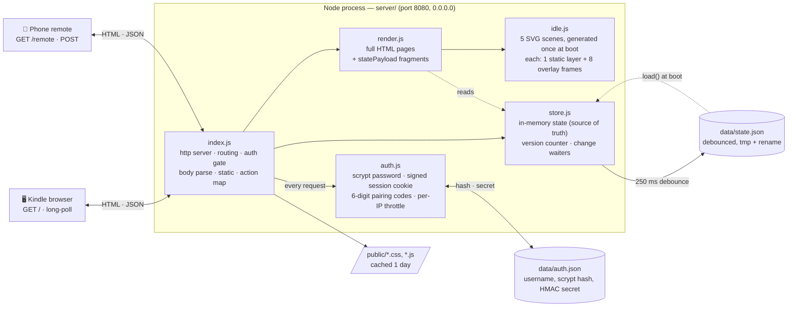
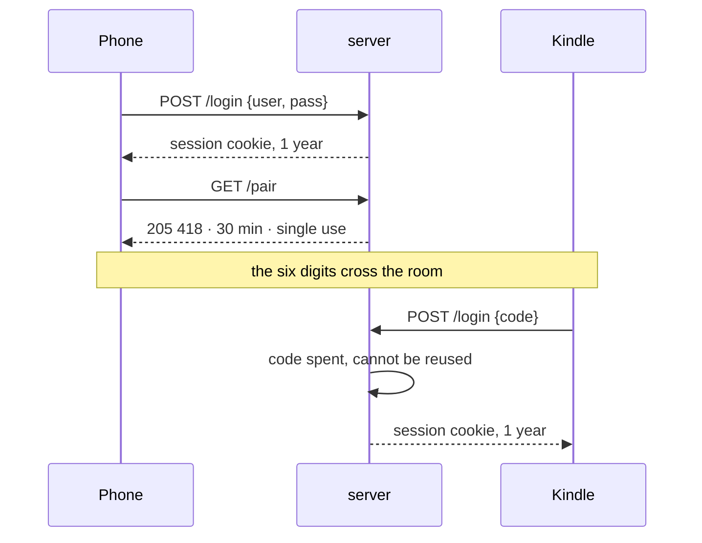
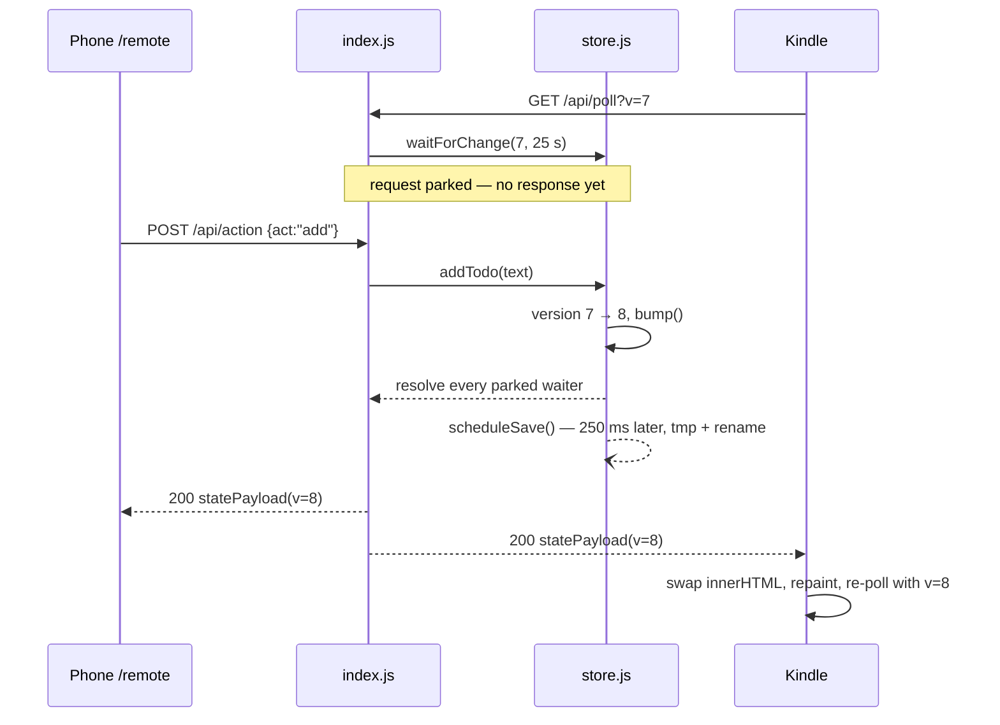

# Architecture

KindleIdle is a single Node process on your LAN. It serves two views of one
shared state: a full-screen **idle/tasks/timer page** for the Kindle browser,
and a **phone remote** for typing. There is no database, no build step, and no
runtime dependencies — only the Node standard library.

Both views sit behind a sign-in. The phone uses a username and password; the
Kindle, whose on-screen keyboard makes that a chore, pairs with a six-digit
code the phone generates. Either way a device holds a signed cookie for a year;
see [ADR 0009](adr/0009-sign-in-on-the-phone-pair-the-kindle.md).

The guiding constraint is the Kindle: an old WebKit build behind an e-ink panel
that repaints slowly. So the server does all the work — layout, escaping,
animation frames, time formatting — and the device only swaps in strings the
server already made.

## Components

| File | Responsibility |
|------|----------------|
| `server/index.js` | HTTP server, routing, the auth gate and login routes, cross-origin POST check, request-body limits, static files, action dispatch, long-poll timeouts, the `ki_theme` cookie read, LAN address banner |
| `server/auth.js` | The account (username + scrypt hash), stateless signed session cookies, six-digit pairing codes, and the per-IP login throttle |
| `server/passwd.js` | `npm run passwd` — changes the account, which signs every device out |
| `server/render.js` | All HTML: the two pages, the self-contained login and pairing pages, plus `statePayload()`, the one fragment shape both the poll and the action response return |
| `server/idle.js` | The five idle scenes — each a static line-art vignette plus 8 tiny overlay frames, all built once at boot and all inlined into both pages |
| `server/store.js` | State, mutations, the version counter, `waitForChange()` waiters, and persistence |
| `public/` | `kindle.css/js`, `remote.css/js` — the only client code |
| `data/state.json` | Persisted todos, stopwatch, and chosen scene. Gitignored, recreated on first write |
| `data/auth.json` | The username, the scrypt hash of the password, and the HMAC secret. Gitignored; deleting it signs every device out and generates a new account |

## Routes

Every route below except `/login`, `/logout` and `/favicon.ico` requires a
valid session cookie. Without one, a page request gets a `303` to
`/login?next=…` and a request that asked for JSON gets a `401`, which both
clients treat as "reload".

| Method | Path | Returns |
|--------|------|---------|
| GET | `/login` | Both doors on one page — username/password, and a pairing-code field. Self-contained, no script, no external asset |
| POST | `/login` | Takes either a `user`+`pass` pair or a `code`; sets the session cookie and `303`s to a validated `next`, or re-renders the form |
| POST | `/logout` | Clears the cookie, `303` to `/login` |
| GET | `/pair` | The pairing desk (needs a session) — shows the code in force, minting one only if none is live |
| POST | `/pair` | Replaces the live code, `303` back to `/pair` |
| GET | `/`, `/index.html` | Kindle page — idle / tasks / timer panels, boot state inlined as `window.BOOT` |
| GET | `/remote` | Phone remote page, same boot-state inlining |
| GET | `/api/poll?v=N` | Long-poll: holds up to 25 s, resolves with a `statePayload` when `version !== N` |
| POST | `/api/action` | Applies one action, then returns the new payload (JSON) or `303` back to the referer (form post) |
| GET | `/favicon.ico` | `204` |
| GET | anything else | Static file from `public/`, path-escape checked |

Actions accepted by `/api/action`: `add`, `toggle`, `del`, `clear`, `scene`,
`sw-start`, `sw-stop`, `sw-toggle`, `sw-reset`, `sw-lap`.

Dark mode is not an action: it is per-device, kept in a `ki_theme` cookie the
server reads when rendering, and never reaches the store. See
[ADR 0008](adr/0008-dark-mode-is-a-per-device-cookie.md).

## The gate

The credential is split by device, because the two screens have nothing in
common as input devices.

The phone signs in with a **username and password** — one account, stored in
`data/auth.json` as a username plus an scrypt hash. There is no user model
beyond that: all state here is shared, so separate accounts would see identical
things. The first run creates the account, prints it once in the startup
banner, and is locked from then on.

The Kindle **pairs with a six-digit code**. A signed-in phone opens `/pair`,
reads the code off the screen, and types it on the shelf. One code exists at a
time, it lasts 30 minutes, it works once, and ten wrong guesses abandon it.
The 30 minutes limits the code, not what it grants — a paired Kindle is signed
in for a year like any other device.

A session is a cookie holding `exp.nonce.HMAC(exp.nonce)` — no server-side
table, so a restart does not sign the Kindle out, which matters for a device
that may go untouched for weeks. The signing key is derived from the secret
*and* the stored credentials, so `npm run passwd` signs every device out by
making the old key cease to exist.

Both doors share one per-IP throttle — five free attempts, then a lockout
doubling from 30 s to 15 minutes, during which even correct credentials are
refused so the lockout cannot be used as an oracle. Sharing it means an
attacker cannot buy fresh tries at one door by alternating with the other.
Hashing runs on the threadpool rather than the event loop, since sign-in is
unauthenticated and the Kindle's long-poll must not stall behind someone
guessing. Every POST is checked for a cross-site `Origin`, since the Kindle's
WebKit predates `SameSite`.

Credentials and the cookie cross the network in the clear — the Kindle cannot
do TLS. See [ADR 0009](adr/0009-sign-in-on-the-phone-pair-the-kindle.md) for
why that is the accepted cost and what it does and does not buy.

## How a change propagates

If nothing changes for 25 s the poll resolves with the current version anyway
and the Kindle simply re-polls — that keeps the socket young enough for the
device and any router in between. `keepAliveTimeout` and `headersTimeout` are
raised past the hold so Node does not cut a parked request; `requestTimeout` is
disabled for the same reason.

## State and durability

In-memory state is the source of truth. Every mutation calls `bump()`, which
increments the version, wakes the parked pollers, and schedules a save. Writes
are coalesced with a 250 ms debounce and land through a temp file + rename, so
a power cut leaves either the old file or the new one, never a half-written
one. A corrupt or missing file loads as blank rather than crashing the server.

The stopwatch stores `startedAt` + `accumulated`, not a ticking value: the
running clock is drawn by the client from a timestamp, so the server never has
to push a frame per second.

## Architecture decisions

The reasoning behind these choices lives in [`docs/adr/`](adr/) — see the
[ADR index](adr/README.md).
