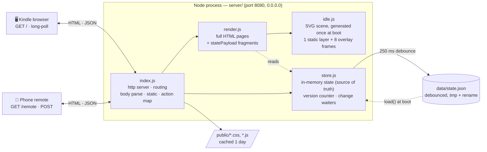
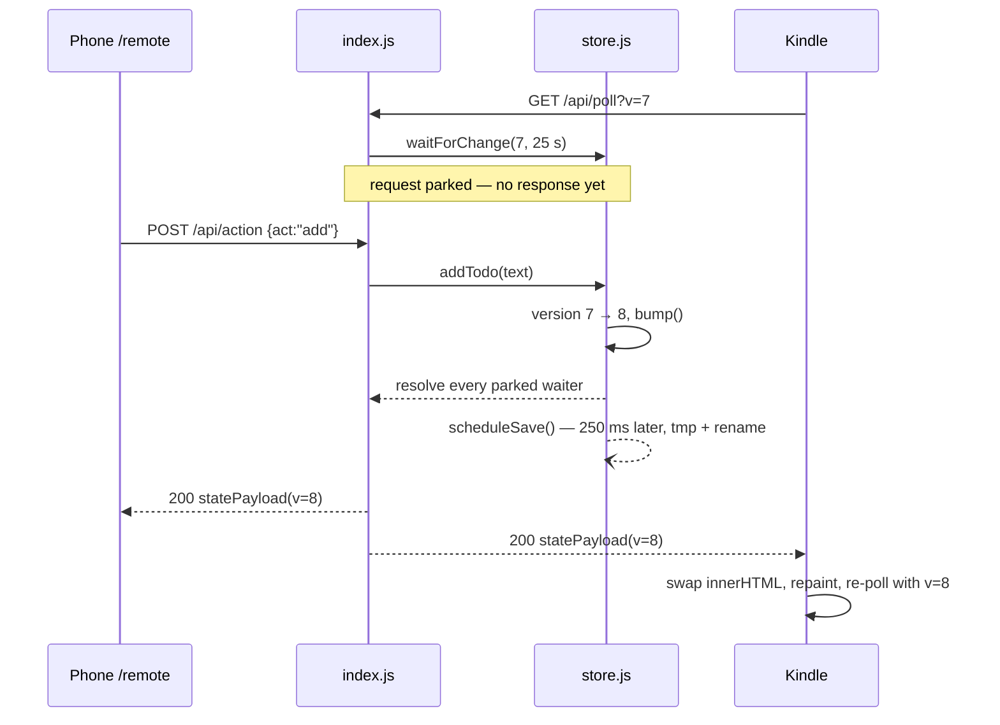

# Architecture

KindleIdle is a single Node process on your LAN. It serves two views of one
shared state: a full-screen **idle/tasks/timer page** for the Kindle browser,
and a **phone remote** for typing. There is no database, no build step, and no
runtime dependencies — only the Node standard library.

The guiding constraint is the Kindle: an old WebKit build behind an e-ink panel
that repaints slowly. So the server does all the work — layout, escaping,
animation frames, time formatting — and the device only swaps in strings the
server already made.

## Components

| File | Responsibility |
|------|----------------|
| `server/index.js` | HTTP server, routing, request-body limits, static files, action dispatch, long-poll timeouts, LAN address banner |
| `server/render.js` | All HTML: the two pages plus `statePayload()`, the one fragment shape both the poll and the action response return |
| `server/idle.js` | The idle scene — a static line-art vignette plus 8 tiny overlay frames, built once at boot |
| `server/store.js` | State, mutations, the version counter, `waitForChange()` waiters, and persistence |
| `public/` | `kindle.css/js`, `remote.css/js` — the only client code (**not yet in the repo**; `render.js` already links them) |
| `data/state.json` | Persisted todos + stopwatch. Gitignored, recreated on first write |

## Routes

| Method | Path | Returns |
|--------|------|---------|
| GET | `/`, `/index.html` | Kindle page — idle / tasks / timer panels, boot state inlined as `window.BOOT` |
| GET | `/remote` | Phone remote page, same boot-state inlining |
| GET | `/api/poll?v=N` | Long-poll: holds up to 25 s, resolves with a `statePayload` when `version !== N` |
| POST | `/api/action` | Applies one action, then returns the new payload (JSON) or `303` back to the referer (form post) |
| GET | `/favicon.ico` | `204` |
| GET | anything else | Static file from `public/`, path-escape checked |

Actions accepted by `/api/action`: `add`, `toggle`, `del`, `clear`,
`sw-start`, `sw-stop`, `sw-toggle`, `sw-reset`, `sw-lap`.

## How a change propagates

If nothing changes for 25 s the poll resolves with the current version anyway
and the Kindle simply re-polls — that keeps the socket young enough for the
device and any router in between. `keepAliveTimeout` and `headersTimeout` are
raised past the hold so Node does not cut a parked request; `requestTimeout` is
disabled for the same reason.

## State and durability

In-memory state is the source of truth. Every mutation calls `bump()`, which
increments the version, wakes the parked pollers, and schedules a save. Writes
are coalesced with a 250 ms debounce and land through a temp file + rename, so
a power cut leaves either the old file or the new one, never a half-written
one. A corrupt or missing file loads as blank rather than crashing the server.

The stopwatch stores `startedAt` + `accumulated`, not a ticking value: the
running clock is drawn by the client from a timestamp, so the server never has
to push a frame per second.

## Architecture decisions

The reasoning behind these choices lives in [`docs/adr/`](adr/) — see the
[ADR index](adr/README.md).
